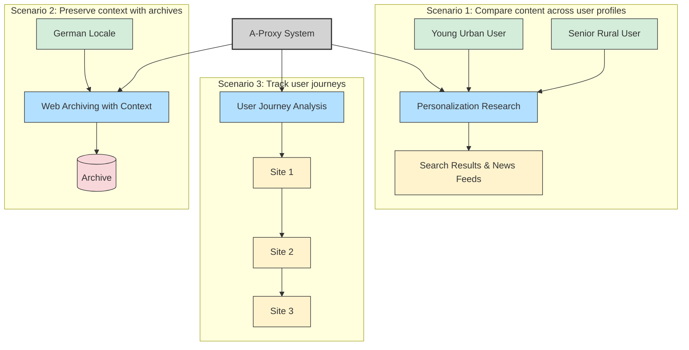

# A-Proxy Demo Scenarios

## Diagram Description

This diagram illustrates the three primary demonstration scenarios for A-Proxy:

1. **Personalization Research**: Shows how different user profiles (young urban user vs. senior rural user) receive different content when accessing the same websites. This demonstrates how A-Proxy can be used to systematically investigate content personalization across platforms.

2. **Web Archiving with Context**: Illustrates how A-Proxy creates contextualized web archives that preserve not just the page content but also the persona context (e.g., German locale) that generated that view. This addresses a significant gap in current web archiving methodologies.

3. **User Journey Analysis**: Demonstrates A-Proxy's ability to record sequences of web interactions under consistent persona settings. This functionality allows researchers to analyze conversion pathways, content discovery patterns, and information-seeking behaviors across multiple sites.

The central A-Proxy system connects to all three scenarios, highlighting its versatility as a research, archiving, and analysis tool.
